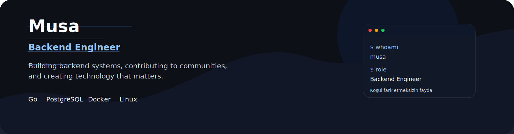
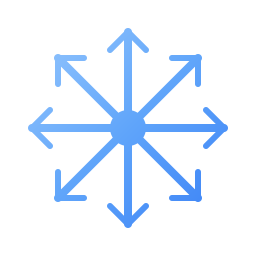

# Hi, I'm Musa 👋

  <picture>
    <source media="(prefers-color-scheme: dark)" srcset="./assets/banner-dark.svg">
    <source media="(prefers-color-scheme: light)" srcset="./assets/banner-light.svg">
    
  </picture>

  
  
  
  

  Building backend systems, contributing to communities, and creating technology that matters.

  <strong>I will continue to produce value regardless of the conditions!</strong>

---

## About Me

I am a Backend Engineer focused on building reliable services, thoughtful developer experiences, and products that solve real problems.

I care about clean architecture, maintainable code, strong foundations, and the communities that help developers grow.

## What I'm Up To

- **Currently working on:** Building scalable backend services and high-performance event infrastructures with **Go** & **Gin**.
- **DevFest Mode:** Cooking up brand new systems for the upcoming DevFest (and probably running on too much coffee).
- **Currently learning:** Diving deep into **Rust** for memory-safe and concurrent systems.
- **Ask me about:** API design, **PostgreSQL/Redis** architecture, and **Docker** deployments.
- **Community:** Organizing impactful developer events with **GDG Bursa** and **Eğitimle Dönüşüm Derneği (ED-Der)**.

## Tech Stack

### Backend

Go · Gin · Python · C# / ASP.NET Core · Rust (learning)

### Databases

PostgreSQL · MySQL · Redis · SQL Server

### DevOps / Infra

Linux · Docker · Git · GitHub

## Featured Projects

<table>
  <tr>
    <td width="33%" valign="top">
      <a href="https://github.com/poizdev/devtv"><h3>DevTV</h3></a>
      
High-performance event infrastructure developed for DevFest Bursa; offering real-time broadcasting, live metric tracking, and instant poll management.

    </td>
    <td width="33%" valign="top">
      <a href="https://github.com/poizdev/devfest-recap"><h3>DevFest Recap</h3></a>
      
System that processes DevFest Bursa participant data with secure AES-GCM encryption and QR code architecture, providing personalized digital memory summaries.

    </td>
    <td width="33%" valign="top">
      <a href="https://github.com/poizdev/devdesk"><h3>DevDesk</h3></a>
      
Scalable task and project management system built with Go & Gin. Includes built-in authentication, role-based access, and a points-based reward system.

    </td>
  </tr>
</table>

## Community

  
  

## GitHub Stats

  
  

  

## Contact

  
  

  

